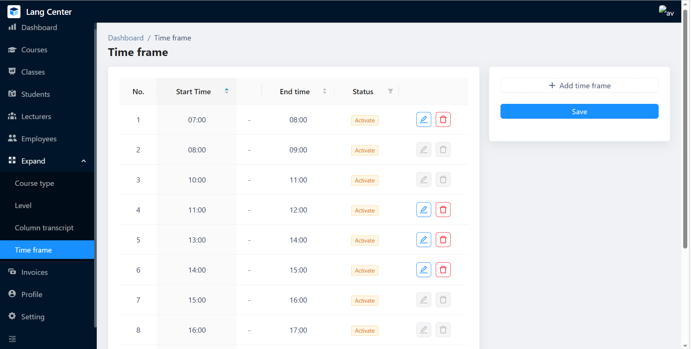

# LangCenter

## Main features

- Course management
- Class management
- Student management
- Staff management
- Statistics
- Settings, regulations

## Tech stack

- Client: React, Ant Design
- State management: React Redux
- Server: Node.js, Express, Sequelize ORM
- Database: PostgreSQL, Firebase Storage (for assets)

## Demo

- Login with one of these accounts:

| Role     | Username | Password |
| -------- | -------- | -------- |
| Admin    | admin    | 123456   |
| Lecturer | lecturer | 123456   |
| Employee | employee | 123456   |


```shel
yarn
yarn start
```

- And enjoy this moment!

## Authors

- [Phạm Thanh Phong](https://github.com/pthanhphong1502)

### Danh sách các màn hình <a name="screen"></a>
<p float="left">
  
  
  
  
  
  
  
  
  
  
  
  
  
  
  
</p>

  
[Lên đầu trang](#top)